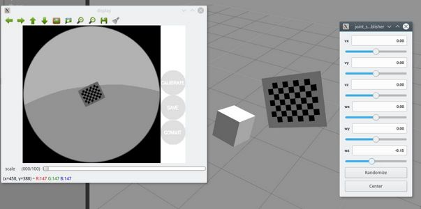

Based on [oKermorgant calibration_gazebo](https://github.com/oKermorgant/calibration_gazebo)

The goal of this package is to allow virtual camera calibration from Gazebo.

A calibration chessboard is spawned inside Gazebo in front of the UAV equipped with cammera, and can be moved in all directions.

Here is a screenshot of the included fish-eye calibration procedure example, with the simulated image on the left and the landmark velocity commands on the right:

The camera topic can then be used to perform classical OpenCV calibration through the camera_calibration package, or custom calibration if other camera projection models are investigated.

In order to spawn and move the landmark, launch `roslaunch calibration_gazebo landmark.launch`

This will try to identify the camera link (actually the first link containing 'camera') and spawn the chessboard in front of the camera. Otherwise the chessboard will spawned at a fixed position. A basic GUI is then used to give velocities to the chessboard.

Two simulated camera examples can be found by launching `roslaunch calibration_gazebo perspective.launch` and `roslaunch calibration_gazebo fisheye.launch`, that outputs the images on the '/camera/image' topic.

The default chessboard dimensions are 8x6 with squares of 0.03 m. They can be changed by editing `landmark.sdf.xacro` and running `xacro` to re-generate the `landmark.sdf` file.

Sometimes it may be necessary to add some light in the simulation for the OpenCV detection to work correctly. 
